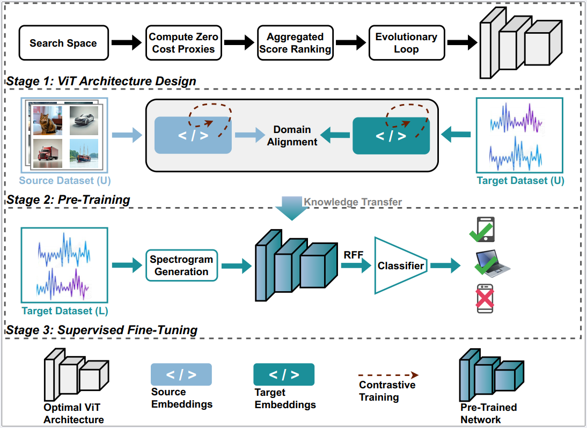

# Replication package for paper "Robust Device Authentication with Zero-Cost NAS and Cross-Domain Knowledge Transfer"


> Figure: A Conceptual Overview 

This repository provides the code and resources for the research paper **"Robust Device Authentication with Zero-Cost NAS and Cross-Domain Knowledge Transfer."** The proposed framework leverages zero-cost Neural Architecture Search (NAS) and cross-domain knowledge transfer to address key challenges in deep learning-based Specific Emitter Identification (SEI).

---

## Framework Overview  
The proposed framework addresses the neural network design complexity and data scarcity challenges of **deep learning-based Specific Emitter Identification (SEI)**. SEI authenticate wireless devices based on their unique Radio Frequency Fingerprints (RFFs). The framework is dubbed **ZNAX**, where **Z** stands for **Zero-Cost**, **NA** for **NAS**, and **X** for **Cross-domain**. **ZNAX** leverages **zero-cost NAS** for optimal architecture discovery for RFF extraction and employs a **cross-domain knowledge transfer** approach to mitigate data scarcity. The **ZNAX** framework operates in three sequential stages, as shown in the figure. **ZNAX** facilitates lightweight architecture search and generalizable wireless device authentication with minimal labeled data, making it well-suited for edge computing scenarios.

## Pipeline Stages

### 1. Zero-Cost NAS
- Searches for the optimal ViT encoder block configuration for RFF extraction based on four designed zero-cost proxies: **Discriminability**, **Trainability**, **Cohesiveness**, and **Diversity**.
- Computes proxy scores through a single forward-backward pass, applies **non-linear aggregation** to obtain an accumulative score for ranking the sampled architectures, and employs **evolutionary search** to refine the selection—identifying the top-ranked architecture that consistently performs well across all proxies.

### 2. Pre-Training Phase
- Source dataset from a data-rich domain and target dataset from a data-scarce domain are fed to identified network to extract respective embeddings.
- Contrastive training and domain alignment are performed jointly. Specifically, the **dual-margin contrastive loss** structures the embedding space for improved discriminability, while the **Maximum Mean Discrepancy (MMD)** objective facilitates alignment between the source domain and the RF data-scarce target domain.

### 3. Supervised Fine-Tuning
- To fully adapt the RFF extractor for SEI, supervised fine-tuning is performed alongside a classifier.
- As a preprocessing step, raw RF samples are first converted into **spectrograms**, and each spectrogram is divided into patches and passed through patch embedding and positional encoding.
- The **resulting representations** are then fed into the **pre-trained network** to extract **RFFs**.
- An **MLP classifier** is placed on top of the **Transformer encoder** to map the extracted RFFs to their corresponding device labels. As fine-tuning progresses, the model gradually adapts to the target domain and enables effective **device authentication under data scarcity**.

---

## Datasets
- For the source domain, well-established, data-rich image classification datasets such as **MNIST**, **CIFAR-10** and **CIFAR-100** are used.
- For the target domain, non-augmented **RFFI dataset** is use which consists of RF samples. **RFFI dataset** can be downloaded from https://ieee-dataport.org/open-access/lorarffidataset

---

## Dependencies
Install the required packages using:

```bash
pip install -r requirements.txt
```
This project is built with **Python ≥ 3.10** and **PyTorch 2.1.0**. Offline computations are performed on **NVIDIA A100 GPU**. Other dependencies include: `torchvision`, `einops`, `numpy`, `scikit-learn`, `scipy`, `matplotlib`, `h5py`, `thop`.

## Important: Update File Paths
In the source code, look for lines marked with:

```python
# Replace with your actual path
```
Please replace these placeholder paths with the actual paths to data or files. For example:

```python
data_path = "/path/to/data"  # Replace with your actual path
```

---

## How to run ZNAX?
### Architecture Search
Run the following script to search for the optimal Vision Transformer (ViT) configuration using zero-cost proxies:

```python 
ZC_Proxies_Ranking.py
```
This script ranks candidate architectures based on four proxy metrics such as discriminability, trainability, cohesiveness, and diversity. Update any lines marked with `# Replace with your actual path` in the script to point to the correct data location on your system.

### Pre-Training and Supervised Fine-Tuning
With the optimal configuration identified during the architecture search phase, update the ViT architecture settings in `main.py` then run:
```python
main.py
```
- Run the pre-training block in the code first. This step performs contrastive training and domain alignment, where dual-margin contrastive loss and MMD are jointly optimized to structure the embedding space—enhancing discriminability while aligning the source domain with the RF data-scarce target domain. 
- Next, run the supervised fine-tuning block in the code. This phase fine-tunes the Transformer encoder alongside a classifier on a small labeled RF dataset to perform final emitter identification. Finally, evaluate the fine-tuned model on the test dataset to assess its performance and generalization ability.

Again, make sure to replace the file path with the actual path to your test dataset in the code.

## Additional Scripts
### Correlation Coefficients
This script computes Spearman's and Kendall's correlation coefficients to evaluate how well the predicted rankings align with the true rankings. To run:
```python
Correlation Coefficients.py
```

### PreTraining_t_SNE
This script visualizes the embeddings learned during pre-training using t-SNE for dimensionality reduction. It helps in visualizing how well the learned embeddings from source and target domains are structured. To run: 
```python
PreTraining_t_SNE.py
```

### #Flops and #Param
This script calculates the FLOPs (Floating Point Operations) and parameter count for the top-ranked architectures, helping to assess their computational efficiency and resource requirements. To run:
```python
#Flops and #Param.py
```
---
## Experiment Variants
The experiments for both conventional training and cross-domain knowledge transfer can be conducted using `main.py`. To switch between them, uncomment or modify the appropriate # lines in the code that correspond to each experimental setting. Make sure to replace the dataset paths and configurations accordingly when switching between modes.
